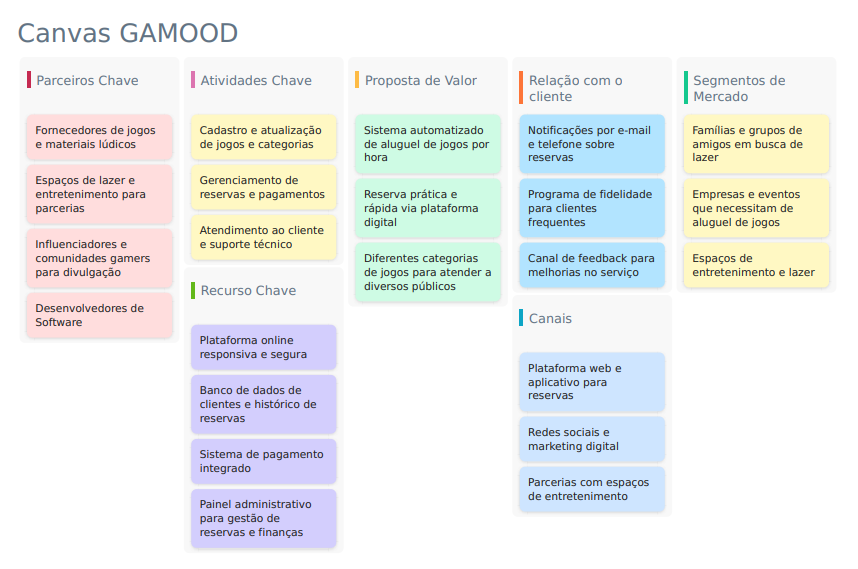
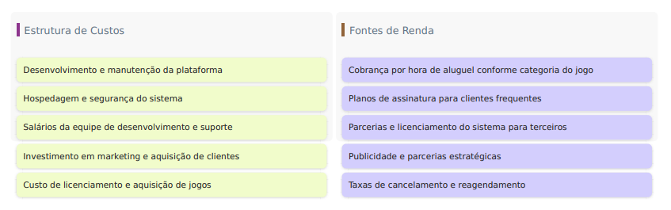

# b\) Desenvolvimento

## I\. Descrição do Projeto

O **Gamood** é um **sistema automatizado de aluguel de jogos por hora**, permitindo que clientes realizem **reservas e pagamentos de forma prática e autônoma**. Os jogos são categorizados em três níveis, cada um com um valor específico por hora. O sistema conta com cadastro de clientes, controle de pagamentos e emissão de tickets com QR Code para acesso. Além disso, permite cancelamentos, reagendamentos e monitoramento em tempo real da disponibilidade dos jogos. Os administradores têm um painel de controle para gerenciar reservas, ajustar preços e analisar relatórios financeiros. Os clientes podem avaliar a experiência, contribuindo para melhorias no serviço.

